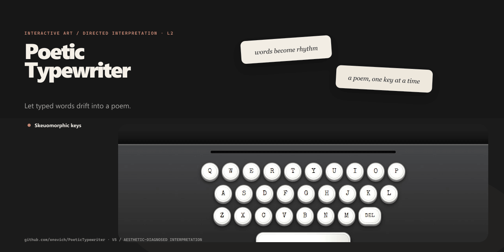

# PoeticTypewriter

[简体中文](README.zh-CN.md)

Let typed words drift into a poem.



## What it includes

- Skeuomorphic keys.
- Floating balloons.
- Daily challenge.

## Getting started

Install dependencies and start the local version:

```bash
npm install
npm run dev
```

The repository also provides `npm run build`.

## Repository map

- `src/` — Application and library source.
- `scripts/` — Runtime or automation scripts.
- `docs/` — Project documentation and design notes.
- `origin/` — Original prototype and design material.
- `.github` — Automation and GitHub Pages workflows.

## Deployment

Play [free mode](https://game.onovich.com/PoeticTypewriter/?mode=free) or the [daily challenge](https://game.onovich.com/PoeticTypewriter/?mode=daily).
Cloudflare serves the project subpath while preserving the games portal. Styles and fonts are self-hosted.
See the [deployment guide](docs/CLOUDFLARE_DEPLOYMENT.md).

## Documentation

- [`docs/ONLINE_COMPETITION_ARCHITECTURE.md`](docs/ONLINE_COMPETITION_ARCHITECTURE.md)
- [`docs/PROJECT_KNOWLEDGE.md`](docs/PROJECT_KNOWLEDGE.md)
- [`origin/design.md`](origin/design.md)
- [`docs/GLOBAL_DOCS_REFERENCE.md`](docs/GLOBAL_DOCS_REFERENCE.md)
- [`docs/INDEX.md`](docs/INDEX.md)

## Status

Production is live. Run API tests with `npm test --prefix api` and browser regression tests with `npm run smoke:cloudflare`.

## License

No project-wide open-source license is included. Bundled font licenses are in `public/licenses/`.
